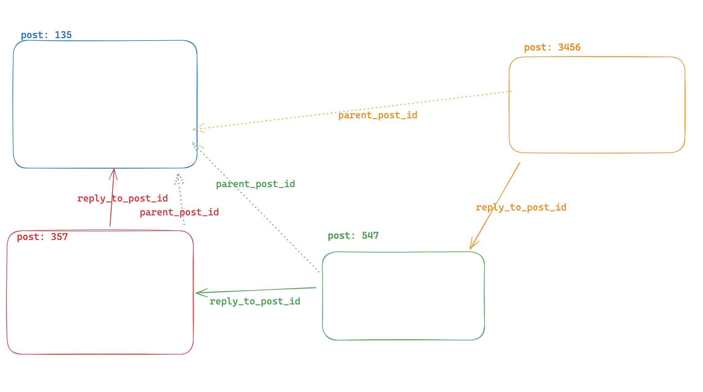
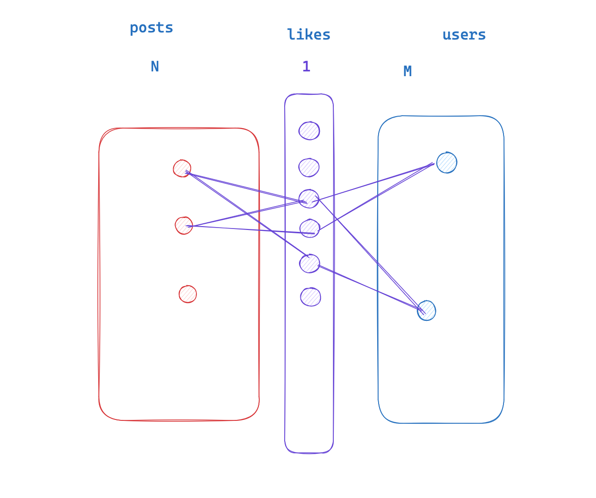

# Social Media Site 
Basic features of Twitter/Mastodon type website. 
Posts, reposts, reply-posts, quotes, likes, follows
Posts can have 1 media 

## Entities 

### User 
- id
- created_at
- updated_at
- username                  // unique
- display_name              // non-unique
- email
- password
- image_id                 // references (media.id)
- bio

### Post 
- id
- created_at
- updated_at
- deleted_at
- user_id               // references (user.id)
- body
- reply_to_post_id      // references (post.id)
- reply_parent_post_id  // references (post.id)
- quoted_post_id        // references (post.id)
- likes_count           // refresh from post_like table
- retweets_count        // refresh from post table
- replies_count         // refresh from post table 

### Media 
- id
- created_at
- updated_at
- deleted_at
- media_type            // image, video, gif
- media_url             // url

### Mapping Tables 

#### User Follow 
- id
- created_at
- updated_at
- follower_id
- followee_id

#### Post Media
- id
- created_at
- updated_at
- post_id
- media_id

#### Post Like
- id
- created_at
- post_id
- user_id

## Functional Requirements

### User 
- Guest can register themselves as an user
- Guest can login (if they had registered themselves)
- Guests can see profile of users
- Guests can search for users by display name
- - Guests can search for users by username
- Users can update their profile
- Users can (un)follow other users

### Post 
- Guests can see all posts 
  - Sort by created_at
  - Sort by likes
  - (has to be pagniated)
  - Filter by userid 
- Users can see all posts by people they follow
- Users can create a post
  - Users can attach a media in a post
- Users can reply to a post
- Users can quote a post
  - Quotes may/maynot have a body (i.e. simply retweet)
- Users can (un)like a post
- Users can delete their own post
- Guests can see who has liked a post
  - (has to be pagniated)
- Guests can see who has retweeted/quoted a post
  - (has to be pagniated)
- Guests can see all replies (including nested replies) to a post
  - (has to be pagniated)

### Media 
- Users can upload media 
- Users can delete their own media

## Notes 

